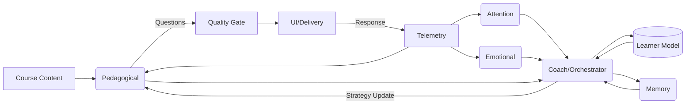
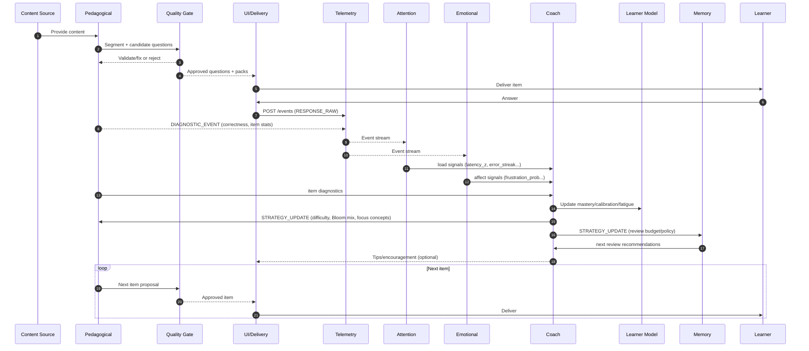
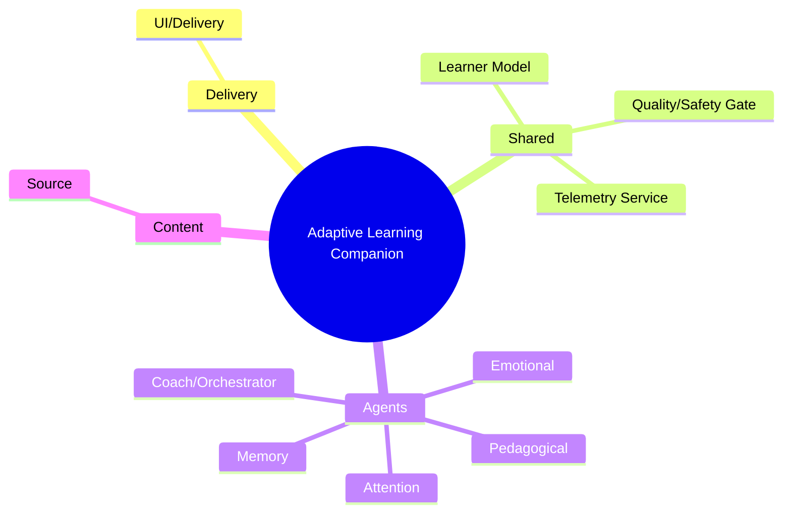
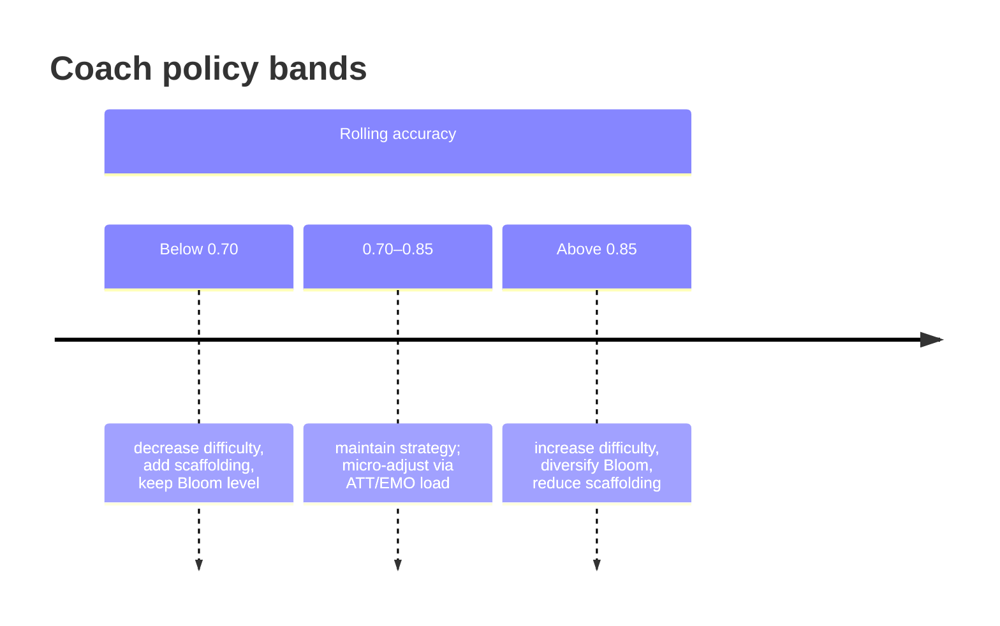
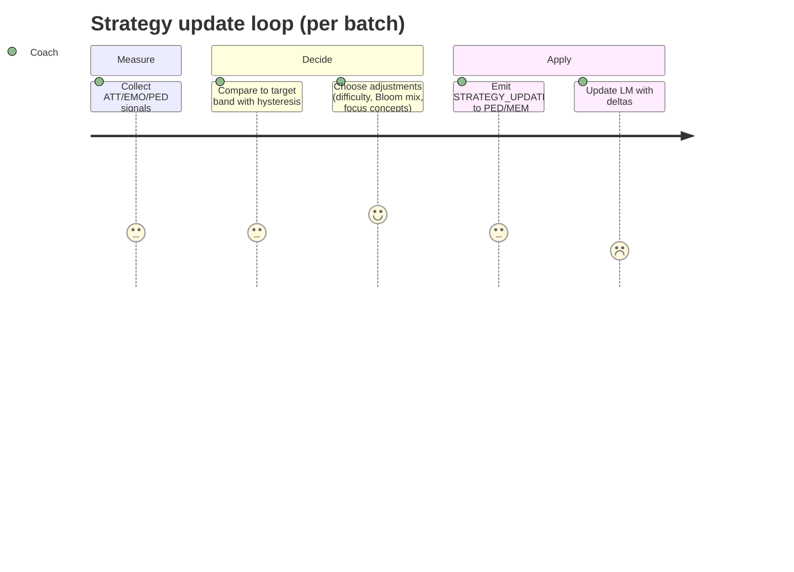
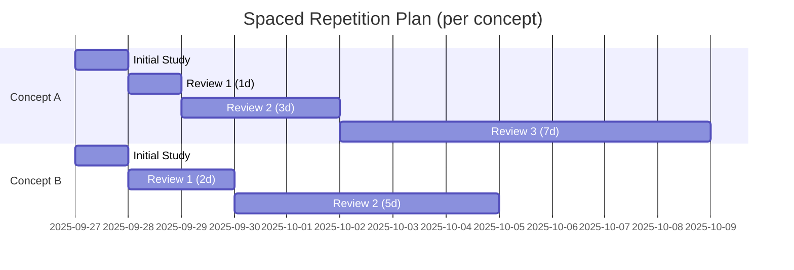

# Adaptive Learning Companion — Architecture (Option A)

## Goals

- Preserve 4 specialized agents (Pedagogical, Memory, Attention, Emotional).
- Add a shared Learner Model (single source of truth), a Coach/Orchestrator (strategy), and a Quality/Safety Gate (content validation).
- Ensure explainability, stable adaptivity, and measurable impact.

## Component Overview

- Pedagogical Agent: segments content, generates questions, scores answers, renders augmentation packs.
- Memory Agent: models retention; schedules spaced reviews; predicts decay.
- Attention Agent: estimates cognitive load (latency z-score, error streaks, hint usage, abandonment).
- Emotional Agent: infers affect from text (and later voice): frustration, demotivation, stress.
- Coach/Orchestrator: consumes diagnostics + Learner Model; sets difficulty, Bloom mix, focus concepts, spacing; sends tips.
- Learner Model (shared): mastery per concept, calibration error, fatigue/affect estimates, spacing schedule, Bloom coverage stats.
- Quality/Safety Gate (optional): validates generated questions, answers, feedback (NLI consistency, duplication, tone).

## High-Level Dataflow

1. Pedagogical → delivers Segment + Questions (validated by Quality Gate).
2. Learner responds → Response event.
3. Attention + Emotional produce signals; Pedagogical provides correctness; diagnostics assembled.
4. Coach updates Learner Model and sends Strategy Update to Pedagogical/Memory.
5. Memory triggers scheduled reviews; loop continues.



## Signals

- Attention: latency_z, error_streak, hint_usage_rate, abandonment_flag.
- Emotional: sentiment_score, frustration_prob, demotivation_prob.
- Pedagogical: correctness, discrimination index, Bloom coverage drift, redundancy.
- Memory: stability score, next_review_time.

## Policies

- Target success band: 70–85% rolling accuracy.
- Bloom target (adjustable): R 0.2, U 0.25, A 0.2, An 0.15, E 0.1, C 0.1.
- Hysteresis to prevent oscillations; quality gate for safety.

## Evaluation & Ablations

- Efficiency: Questions-to-0.8 mastery (≥ −25% vs static/random).
- Retention: 48h uplift (+10–15%).
- Calibration: Brier improvement (≥ 15%).
- Bloom adherence: < 10% deviation per level.
- Quality: hallucination/contradiction < 2%.

## Interaction sequence (end-to-end)



## Component map (non-boxy)



Optional flow alternative (if your Mermaid renderer supports it):


## Telemetry schema view (mindmap)

```mermaid
mindmap
  root((Sample))
    segment
      segment_id
      topic
      text
      concepts[]
    question
      question_id
      bloom
      type
      stem
      answer_key
      distractors[]
    response
      user_id
      correct
      user_answer
      confidence (0-100)
      latency_ms
      hint_used
    affect
      labels
      valence (-1..1)
      arousal (0..1)
      source
    derived_signals
      latency_z
      error_streak
      novelty_score
    intervention
      recommended
      accepted
    consent
      store_free_text
      store_audio
    timestamps
      created_at (iso8601)
      updated_at (iso8601)
```

## Coach policy guidance (timeline + journey)





## Spaced review schedule (example)


